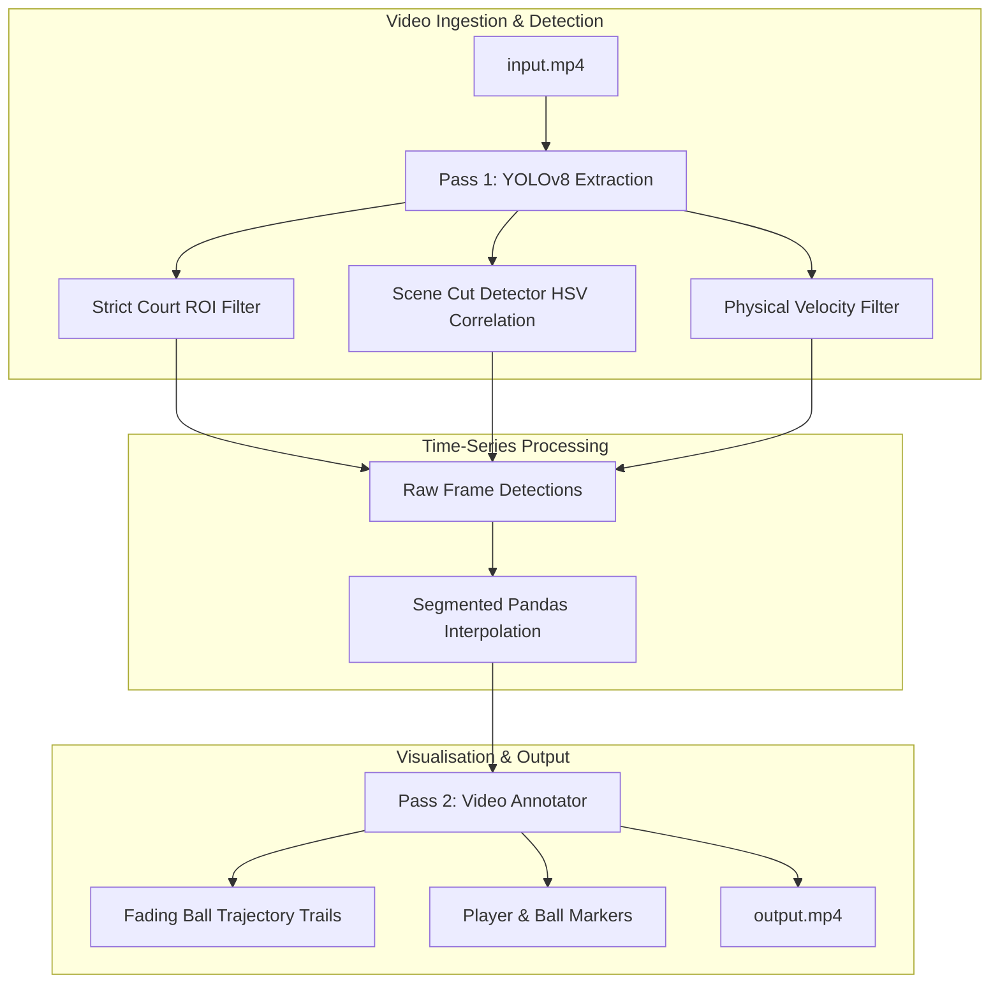

# 🎾 AI Tennis Visualiser & Analytics Engine

An end-to-end computer vision and deep learning system designed to track tennis players, estimate ball trajectories, detect court boundaries, and extract kinetic match analytics from standard broadcast video feeds.

Inspired by and building upon the architecture of [`abdullahtarek/tennis_analysis`](https://github.com/abdullahtarek/tennis_analysis).

---

## 🌟 Key Features

- **Multi-Object Tracking (MOT)**: Tracks player bounding boxes and ball positions across video frames.
- **Tuned Ball Inference**: Low-confidence extraction tuned to capture high-speed, motion-blurred tennis balls.
- **Missing Frame Interpolation**: Two-pass temporal interpolation using Pandas to reconstruct ball trajectories during occlusion or dropped detection frames.
- **Tracking Safety Guardrails**:
  - **Velocity / Distance Filtering**: Drops physically impossible frame-to-frame coordinate leaps ($> 180\text{px}/\text{frame}$).
  - **Temporal Gap Limits (`MAX_MISSING_FRAMES = 7`)**: Prevents linking unrelated strokes across large time gaps.
  - **Scene Cut & Angle Change Reset**: Uses HSV 2D histogram correlation to hard-reset trajectory queues on camera angle switches.
  - **Court ROI Polygon Masking**: Eliminates false positives from background spectators, referees, and line judges.
- **Modular Package Structure**: Clean separation into detectors, trackers, visualizers, utilities, and configuration.

---

## 📐 System Architecture



---

## 🚀 Quick Start

### 1. Prerequisites
- Python 3.8+
- [FFmpeg](https://ffmpeg.org/) (optional, for advanced video encoding)

### 2. Installation
Clone the repository and install dependencies:

```bash
git clone https://github.com/water-bear-dev/tennis-visualiser.git
cd tennis-visualiser
python3 -m venv venv
source venv/bin/activate
pip install -r requirements.txt
```

### 3. Running the Visualiser
Place your match video as `input.mp4` in the project root and execute:

```bash
python main.py
```

The script will automatically download standard YOLO weights (if custom weights are not found) and produce `output.mp4`.

---

## 📁 Repository Structure

```
tennis-visualiser/
├── src/
│   ├── __init__.py
│   ├── config.py              # Tunable thresholds, paths, ROI coordinates
│   ├── utils/
│   │   ├── roi_utils.py       # Spatial polygon coordinate conversions
│   │   └── scene_utils.py     # HSV histogram comparison for scene cut detection
│   ├── detectors/
│   │   └── yolo_detector.py   # Model weight loader & Pass 1 inference extraction
│   ├── trackers/
│   │   └── ball_interpolator.py # Time-series interpolation & gap constraints
│   └── visualizers/
│       └── video_annotator.py # Pass 2 rendering, trajectory polylines, HUD
├── features.md                # Multi-phase roadmap and feature specification
├── development_blog.md        # Technical engineering journey and post-mortems
├── main.py                    # Pipeline entrypoint
├── requirements.txt           # Project dependencies
└── .gitignore
```

---

## 🗺️ Roadmap

For the complete multi-phase deployment roadmap (Court CNN Keypoint Detection, Homography Transformation, Mini-Court 2D Radar, Shot Speed $\text{km/h}$, and Interactive Dashboards), see **[`features.md`](features.md)**.

For the engineering journey, post-mortems, and technical decision logs, check out **[`development_blog.md`](development_blog.md)**.
