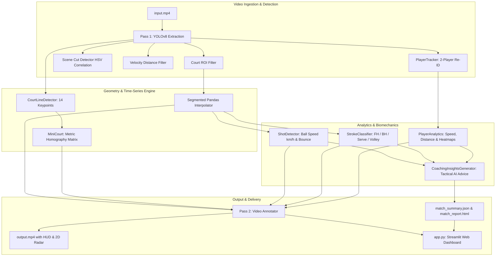

# 🎾 AI Tennis Visualiser & Analytics Engine

An end-to-end computer vision and deep learning platform designed to track tennis players, estimate ball trajectories, detect court boundaries via perspective homography, classify stroke biomechanics, and deliver automated AI coaching analytics from standard broadcast video feeds.

Inspired by and building upon the architecture of [`abdullahtarek/tennis_analysis`](https://github.com/abdullahtarek/tennis_analysis).

---

## 🌟 Comprehensive Feature Suite

### 1. Multi-Object Tracking & Ball Trajectory
- **Persistent 2-Player Re-ID (`PlayerTracker`)**: Spatially partitions court players across the net line into **Player 1** (near court) and **Player 2** (far court), filtering out referees and ball boys.
- **Tuned Ball Inference**: Low-confidence thresholding (`0.12`) to detect small, motion-blurred tennis balls.
- **Missing Frame Interpolation**: Segmented linear interpolation bounded by `MAX_MISSING_FRAMES = 7` to reconstruct occluded ball paths.
- **4 Tracking Safety Guardrails**: Velocity/distance jump filters ($180\text{px}$), track gap resets, strict court ROI polygon masking, and HSV 2D histogram scene cut detection.

### 2. Geometry, Homography & 2D Top-Down Radar
- **14 Court Keypoints Extraction (`CourtLineDetector`)**: Detects standard ITF court intersections with broadcast calibration fallback.
- **Perspective Homography Engine (`MiniCourt`)**: Projective transformation matrices mapping camera pixels $(u, v)$ to top-down 2D canvas pixels and real-world metric meters ($23.77\text{m} \times 10.97\text{m}$).
- **2D Mini-Court Bird's-Eye Radar**: Real-time overlay in the top-right corner tracking Player 1, Player 2, and ball trajectory trails.

### 3. Shot Analytics & Biomechanics
- **Hit Event Detection**: Inflection point analysis ($\Delta v_y$) attributing shots to Player 1 or Player 2.
- **Physical Ball Velocity ($\text{km/h}$)**: Real-world metric speed measurement over frame deltas.
- **Automated In/Out Line Calling**: Evaluates ball contact against official ITF singles boundary lines.
- **Stroke Classification (`StrokeClassifier`)**: Classifies shots into **Serve**, **Forehand**, **Backhand**, or **Volley/Smash**.
- **Live Rally Counter**: Real-time on-screen counter tracking consecutive shots.

### 4. Player Kinetics & Exertion
- **Instantaneous Running Speed ($\text{km/h}$)**: Rolling 5-frame velocity measurement capturing sprint bursts ($0 - 32\text{ km/h}$).
- **Cumulative Distance Covered ($m$)**: Integrates player movement meters across all rallies.
- **2D Positional Heatmaps**: High-resolution Gaussian density heatmaps (`heatmap_player_1.png` and `heatmap_player_2.png`) showing tactical court distribution.

### 5. Automated AI Coaching Intelligence
- **Tactical Profiling (`CoachingInsightsGenerator`)**: Identifies stroke bias (forehand dominance vs two-wing balance), court positioning efficiency, and match tempo rhythm.
- **Actionable Coaching Recommendations**: Generates player-specific tactical takeaways.

### 6. Production Dashboard & Reporting Suite
- **Broadcast Telemetry HUD**: On-screen overlay card showing live rally count, stroke type & ball speed ticker, player sprint speeds, cumulative distance, and `IN`/`OUT` badge.
- **Structured JSON Export (`match_summary.json`)**: Full machine-readable match telemetry.
- **Standalone HTML Report (`match_report.html`)**: Responsive dark-mode report with KPI cards, head-to-head comparison tables, and embedded heatmaps.
- **Interactive Streamlit Web Dashboard (`app.py`)**: Multi-tab web application for video playback, parameter tuning, tactical coaching review, and report downloads.

---

## 📐 System Architecture



---

## 🚀 Quick Start

### 1. Installation
```bash
git clone https://github.com/water-bear-dev/tennis-visualiser.git
cd tennis-visualiser
python3 -m venv venv
source venv/bin/activate
pip install -r requirements.txt
```

### 2. Run Full Match Pipeline
Place your footage as `input.mp4` and run:
```bash
python main.py
```
Outputs generated:
- `output.mp4` (Annotated broadcast video with HUD and 2D radar)
- `match_summary.json` (Structured telemetry export)
- `match_report.html` (Standalone HTML match report)
- `heatmap_player_1.png` & `heatmap_player_2.png` (Court heatmaps)

### 3. Launch Interactive Web UI
```bash
streamlit run app.py
```

---

## 📁 Repository Structure

```
tennis-visualiser/
├── src/
│   ├── __init__.py
│   ├── config.py                  # Tunable thresholds, paths, ROI coordinates
│   ├── utils/
│   │   ├── roi_utils.py           # Spatial polygon coordinate conversions
│   │   └── scene_utils.py         # HSV histogram comparison for scene cuts
│   ├── detectors/
│   │   └── yolo_detector.py       # Model loader & Pass 1 inference extraction
│   ├── trackers/
│   │   ├── ball_interpolator.py   # Time-series interpolation & gap limits
│   │   └── player_tracker.py      # Net-split persistent 2-player Re-ID
│   ├── court_detector/
│   │   └── court_line_detector.py # 14 court keypoint extraction
│   ├── mini_court/
│   │   └── mini_court.py          # Homography engine & 2D top-down radar
│   ├── analysis/
│   │   ├── shot_detector.py       # Hit detection, ball speed (km/h) & line calls
│   │   ├── stroke_classifier.py   # Forehand, Backhand, Serve, Volley classifier
│   │   ├── player_analytics.py    # Player running speeds, distance & heatmaps
│   │   ├── coaching_insights.py   # Automated AI coaching & tactical profiling
│   │   └── report_generator.py    # JSON & HTML report compilation
│   └── visualizers/
│       └── video_annotator.py     # Pass 2 rendering, HUD, polylines & radar
├── app.py                         # Interactive Streamlit Web Application
├── features.md                    # Roadmap & Feature Implementation Matrix
├── development_blog.md            # Technical engineering journal (10 entries)
├── main.py                        # Pipeline entrypoint
├── requirements.txt               # Dependencies
└── .gitignore
```

---

## 🗺️ Roadmap & Documentation
- Full implementation breakdown: **[`features.md`](features.md)**
- Engineering journal & decision logs: **[`development_blog.md`](development_blog.md)**
