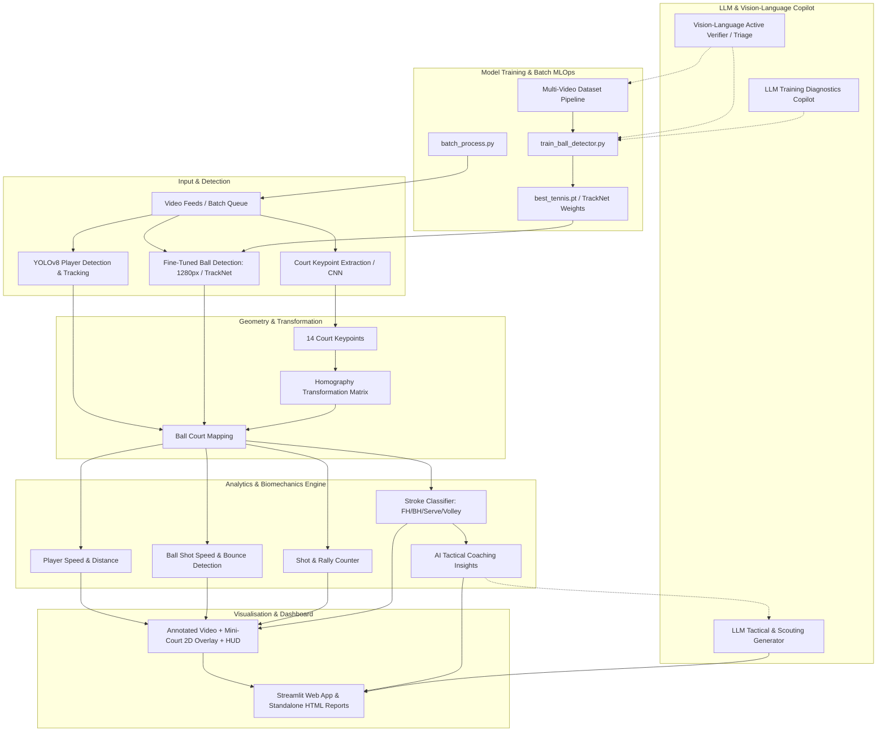

# Tennis Analysis System: Phased Deployment & Feature Roadmap

This document outlines the phased deployment strategy, implementation matrix, and future expansion roadmap for the **AI Tennis Analytics Platform**, modeled after and expanding upon the reference architecture in [`abdullahtarek/tennis_analysis`](https://github.com/abdullahtarek/tennis_analysis).

---

## Architecture Overview

---

## Implementation Status Matrix

| Phase | Feature ID | Feature Description | Status | Implementation Module |
| :--- | :---: | :--- | :---: | :--- |
| **Phase 1** | **F1.1** | **Fine-Tuned Ball Detection & Weight Loader** | 🟢 **Complete** | `src/detectors/yolo_detector.py` |
| | **F1.2** | **Persistent 2-Player Re-ID Tracking** | 🟢 **Complete** | `src/trackers/player_tracker.py` |
| | **F1.3** | **Frame Interpolation & 4 Tracking Safety Guardrails** | 🟢 **Complete** | `src/trackers/ball_interpolator.py` |
| **Phase 2** | **F2.1** | **14-Point Tennis Court Keypoint Detector** | 🟢 **Complete** | `src/court_detector/court_line_detector.py` |
| | **F2.2** | **Perspective Homography Transformation Engine** | 🟢 **Complete** | `src/mini_court/mini_court.py` |
| | **F2.3** | **2D Mini-Court Bird's-Eye Radar Overlay** | 🟢 **Complete** | `src/mini_court/mini_court.py` |
| **Phase 3** | **F3.1** | **Player Hit Event & Stroke Direction Detection** | 🟢 **Complete** | `src/analysis/shot_detector.py` |
| | **F3.2** | **Physical Ball Velocity in km/h** | 🟢 **Complete** | `src/analysis/shot_detector.py` |
| | **F3.3** | **Automated In/Out Line Boundary Calling** | 🟢 **Complete** | `src/analysis/shot_detector.py` |
| | **F3.4** | **Live Rally Shot Counter** | 🟢 **Complete** | `src/analysis/shot_detector.py` |
| **Phase 4** | **F4.1** | **Instantaneous Running Speed in km/h** | 🟢 **Complete** | `src/analysis/player_analytics.py` |
| | **F4.2** | **Cumulative Distance Covered in meters** | 🟢 **Complete** | `src/analysis/player_analytics.py` |
| | **F4.3** | **2D Spatial Court Heatmaps (P1 & P2)** | 🟢 **Complete** | `src/analysis/player_analytics.py` |
| **Phase 5** | **F5.1** | **Broadcast Telemetry HUD Card** | 🟢 **Complete** | `src/visualizers/video_annotator.py` |
| | **F5.2** | **Structured JSON Match Export** (`match_summary.json`) | 🟢 **Complete** | `src/analysis/report_generator.py` |
| | **F5.3** | **Standalone Responsive HTML Match Report** (`match_report.html`) | 🟢 **Complete** | `src/analysis/report_generator.py` |
| | **F5.4** | **Interactive Streamlit Web Dashboard** (`app.py`) | 🟢 **Complete** | `app.py` |
| **Phase 6** | **F6.1** | **Kinematic Stroke Classifier (Serve, FH, BH, Volley)** | 🟢 **Complete** | `src/analysis/stroke_classifier.py` |
| | **F6.2** | **AI Tactical Coaching Intelligence Generator** | 🟢 **Complete** | `src/analysis/coaching_insights.py` |
| | **F6.3** | **Multi-Tab Coaching Dashboard & Telemetry Review** | 🟢 **Complete** | `app.py` & `match_report.html` |
| **Phase 7** | **F7.1** | **Multi-Video Frame Harvester** | 🟢 **Complete** | `training/extract_frames.py` |
| | **F7.2** | **Semi-Supervised Auto-Labeling Engine** | 🟢 **Complete** | `training/auto_label.py` |
| | **F7.3** | **Custom Multi-Video Training Suite** | 🟢 **Complete** | `training/train_ball_detector.py` |
| | **F7.4** | **Multi-Match Batch Processor** | 🟢 **Complete** | `batch_process.py` |
| | **F7.5** | **Tournament Comparative Dashboard** | 🟢 **Complete** | `app.py` (Tournament Tab) |
| **Phase 8** | **F8.1** | **VLM-Assisted Active Verification & Label Denoising** | 🟢 **Complete** | `training/vlm_verifier.py` |
| | **F8.2** | **Smart Video Triage & Rally Segmentation (Non-Play Filter)** | 🟢 **Complete** | `training/video_triage.py` |
| | **F8.3** | **Automated Training Diagnostics & Hyperparameter Copilot** | 🟢 **Complete** | `training/train_diagnostics.py` |
| | **F8.4** | **LLM-Powered Narrative Tactical Scouting Reports** | 🟢 **Complete** | `src/analysis/llm_scout.py` |
