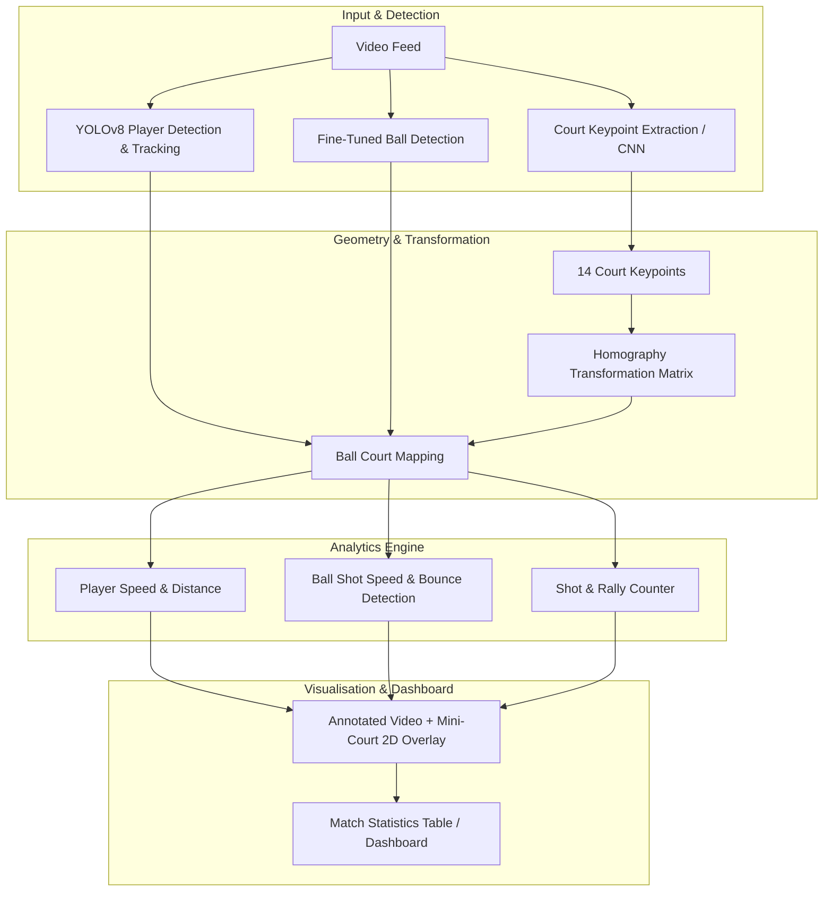

# Tennis Analysis System: Phased Deployment & Feature Roadmap

This document outlines the phased deployment strategy to transform our tennis visualizer into a full-scale **AI Tennis Analytics Platform**, modeled after the reference architecture in [`abdullahtarek/tennis_analysis`](https://github.com/abdullahtarek/tennis_analysis).

---

## Architecture Overview

---

## Phased Deployment Roadmap

### Phase 1: Foundation & Accurate Multi-Object Detection (Current Baseline + Enhancements)
**Goal:** Reliable, robust tracking of both players and the tennis ball across varying broadcast angles.

* **F1.1: Fine-Tuned Tennis Ball Detector Integration**
  - Download and integrate fine-tuned YOLO ball weights (`yolov5_best.pt` or `tennis_ball_detector.pt`) specifically trained on high-velocity tennis ball datasets.
  - Implement dynamic fallback if custom weights are missing.
* **F1.2: Persistent Player Re-Identification & Tracking**
  - Implement ByteTrack or StrongSORT multi-object tracking (MOT) for players.
  - Automatically identify and isolate the **two active players** on court, filtering out ball kids, referees, and audience members.
* **F1.3: Frame Interpolation & Trajectory Safety** *(Completed)*
  - Linear/polynomial coordinate interpolation for occluded/motion-blurred frames.
  - Trajectory reset on scene cuts and frame gaps $> 7$.
  - Velocity filtering to reject impossible single-frame jumps.

---

### Phase 2: Court Line & Keypoint Detection (Geometry & Homography)
**Goal:** Automatically detect tennis court geometry to enable pixel-to-real-world coordinate mapping.

* **F2.1: CNN-Based Tennis Court Keypoint Detector**
  - Train/integrate a PyTorch ResNet-based CNN keypoint extractor to predict the 14 standard tennis court boundary keypoints (corners, service boxes, baseline, net intersections).
* **F2.2: Perspective Transformation (Homography Engine)**
  - Compute the $3 \times 3$ homography matrix $H$ mapping 2D video pixel coordinates $(u, v)$ to metric real-world court coordinates $(X, Y)$ in meters (ITF standard dimensions: $23.77\text{m} \times 10.97\text{m}$).
* **F2.3: 2D Mini-Court Bird's-Eye Overlay**
  - Draw a dynamic 2D mini-court diagram in the corner of the output video.
  - Project real-time positions of Player 1, Player 2, and the Ball onto the 2D top-down mini-court.

---

### Phase 3: Shot Analytics & Rally Intelligence
**Goal:** Extract advanced game metrics, stroke detection, and rally analytics.

* **F3.1: Shot & Hit Event Detection**
  - Detect exact frames where a player strikes the ball by analyzing ball trajectory direction reversals and player-ball proximity.
* **F3.2: Ball Shot Speed & Bounce Detection**
  - Calculate real-world ball velocity in $\text{km/h}$ or $\text{mph}$ using the homography transformation and video frame rate:
    $$v_{\text{ball}} = \frac{\Delta \text{distance}_{\text{meters}}}{\Delta t}$$
  - Detect court bounce events (inflection points in $y$-trajectory and ground plane contact).
* **F3.3: In/Out Line Calling System**
  - Evaluate bounce coordinates against the official boundary lines (singles and doubles sidelines/baselines) to determine In/Out calls with visual indicators.
* **F3.4: Rally & Stroke Counter**
  - Automatically maintain live shot counts per rally, stroke type (forehand/backhand based on player bounding box relative to ball), and rally duration.

---

### Phase 4: Player Performance & Kinetic Metrics
**Goal:** Track athletic performance, movement patterns, and physical exertion.

* **F4.1: Player Movement Speed & Cumulative Distance**
  - Calculate instantaneous running speed ($\text{km/h}$) and total distance covered ($\text{meters}$) per player across points.
* **F4.2: Court Heatmaps & Positional Dominance**
  - Generate 2D spatial density heatmaps on the mini-court showing player positioning (baseline defense vs. net play).
* **F4.3: Reaction Time & Recovery Speed**
  - Measure time taken from opponent's shot hit to player's reaction movement and baseline recovery.

---

### Phase 5: Production Dashboard, UI & Export Suite
**Goal:** Deliver a professional, exportable match report and interactive visualizer.

* **F5.1: Real-Time HUD Overlay**
  - Modern, broadcast-quality HUD displaying:
    - Current shot speed ticker ($\text{km/h}$)
    - Live rally shot counter
    - Player 1 & Player 2 speed cards
    - Mini-court 2D radar in the top right/left corner
* **F5.2: Post-Match Summary PDF & JSON Export**
  - Export structured match statistics (total shots, average serve speed, max speed, total distance ran, heatmap snapshots) into JSON and a formatted PDF match report.
* **F5.3: Interactive Web Dashboard (Streamlit / Next.js)**
  - Web UI allowing coaches/players to upload match footage, adjust court keypoints if needed, and interactively scrub through rallies with annotated statistics.

---

## Deployment Matrix

| Phase | Core Deliverables | Target Modules | Key Dependencies |
| :--- | :--- | :--- | :--- |
| **Phase 1** | Fine-tuned ball detection, 2-player ID tracking, trajectory safety | `src/detectors/`, `src/trackers/` | `ultralytics`, `opencv-python` |
| **Phase 2** | Court CNN keypoints, Homography matrix, Mini-court 2D radar | `src/court_detector/`, `src/mini_court/` | `torch`, `torchvision`, `scipy` |
| **Phase 3** | Shot detection, ball speed ($\text{km/h}$), bounce & In/Out calling | `src/analysis/shot_analysis.py` | `numpy`, `pandas` |
| **Phase 4** | Player speed ($\text{km/h}$), distance covered, court heatmaps | `src/analysis/player_analysis.py` | `matplotlib`, `seaborn` |
| **Phase 5** | Broadcast HUD, stats export (JSON/PDF), interactive web UI | `src/visualizers/hud.py`, `app.py` | `streamlit` / `reportlab` |
