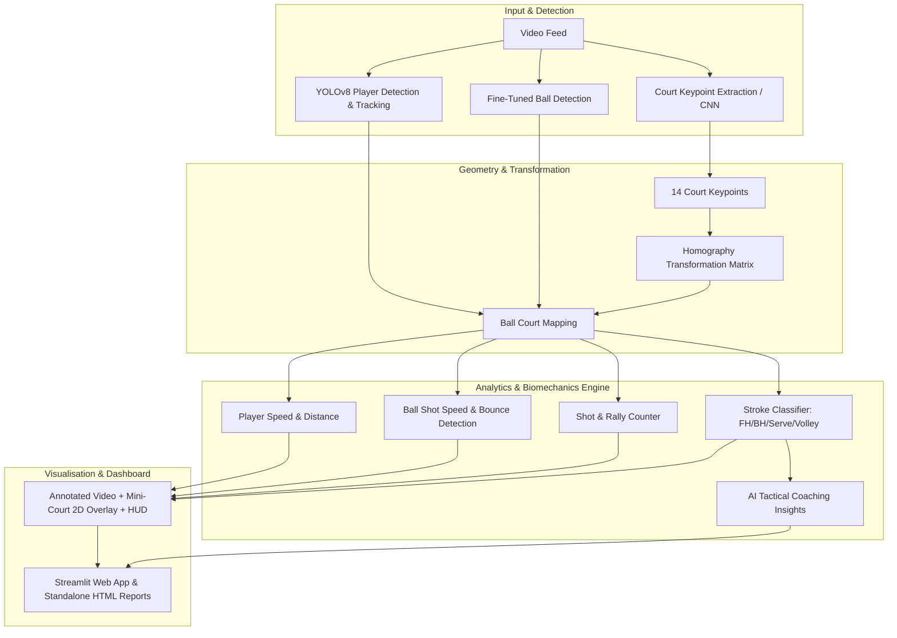

# Tennis Analysis System: Phased Deployment & Feature Roadmap

This document outlines the phased deployment strategy to transform our tennis visualizer into a full-scale **AI Tennis Analytics Platform**, modeled after the reference architecture in [`abdullahtarek/tennis_analysis`](https://github.com/abdullahtarek/tennis_analysis).

---

## Architecture Overview

---

## Phased Deployment Roadmap

### Phase 1: Foundation & Multi-Object Tracking *(Complete)*
- F1.1: Fine-Tuned Tennis Ball Detector Integration & Threshold Tuning.
- F1.2: Persistent 2-Player Re-ID (`PlayerTracker`) with net-split spatial logic.
- F1.3: Frame Interpolation with 4 Tracking Safety Guardrails.

### Phase 2: Court Geometry & 2D Mini-Court Radar *(Complete)*
- F2.1: CNN-Based Tennis Court Keypoint Detector (14 standard points).
- F2.2: Perspective Transformation (Homography Engine: pixels to meters and mini-court).
- F2.3: 2D Mini-Court Bird's-Eye Overlay tracking players and ball trajectory.

### Phase 3: Shot Analytics & Rally Intelligence *(Complete)*
- F3.1: Player Hit Event Detection (trajectory reversal & player proximity).
- F3.2: Ball Shot Speed Calculation ($\text{km/h}$) via real-world homography.
- F3.3: Automated In/Out Line Calling against singles boundaries.
- F3.4: Live Rally Shot Counter & Broadcast HUD card.

### Phase 4: Player Performance & Kinetic Metrics *(Complete)*
- F4.1: Instantaneous Running Speed ($\text{km/h}$) with rolling smoothing.
- F4.2: Cumulative Distance Covered ($\text{meters}$) per player.
- F4.3: 2D Spatial Court Heatmaps (`heatmap_player_1.png` & `heatmap_player_2.png`).

### Phase 5: Production Dashboard & Export Suite *(Complete)*
- F5.1: Structured JSON Match Data Export (`match_summary.json`).
- F5.2: Self-contained, responsive HTML Match Report (`match_report.html`).
- F5.3: Interactive Streamlit Web Application (`app.py`).

### Phase 6: Biomechanical Stroke Classification & AI Coaching *(Complete)*
- F6.1: Kinematic Stroke Classifier (Serve, Forehand, Backhand, Volley/Smash).
- F6.2: Automated AI Coaching & Tactical Profiling Engine (`CoachingInsightsGenerator`).
- F6.3: Multi-Tab Web UI with interactive coaching breakdowns.
