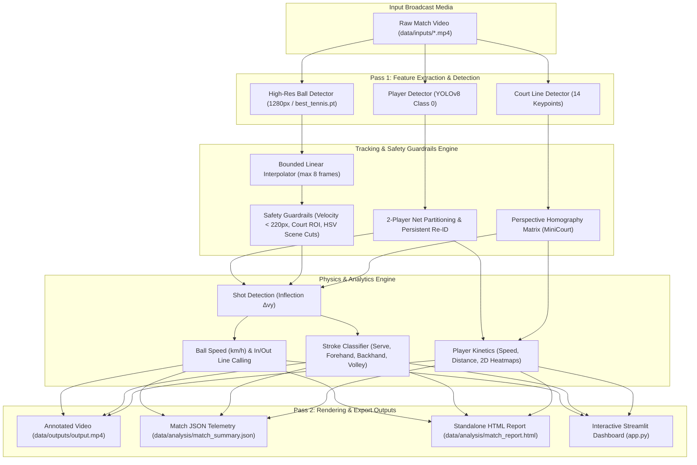
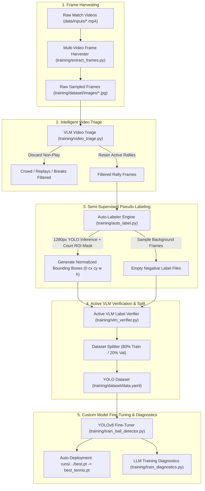

# 🎾 AI Tennis Visualiser: Model Architecture & Training Guide

This guide provides a comprehensive technical overview of the deep learning models, computer vision pipeline, dataset engineering workflows, and training procedures used in the **AI Tennis Visualiser & Analytics Engine**.

---

## 📑 Table of Contents
1. [System Architecture Overview](#1-system-architecture-overview)
2. [Core Deep Learning Models](#2-core-deep-learning-models)
3. [The Tennis Ball Tracking Challenge](#3-the-tennis-ball-tracking-challenge)
4. [Dataset Engineering & Multi-Video Pipeline](#4-dataset-engineering--multi-video-pipeline)
5. [Model Training & Fine-Tuning](#5-model-training--fine-tuning)
6. [Local LLM & VLM Copilots](#6-local-llm--vlm-copilots)
7. [Inference Fallback Hierarchy](#7-inference-fallback-hierarchy)
8. [End-to-End Training Walkthrough](#8-end-to-end-training-walkthrough)
9. [Troubleshooting & Performance Tuning](#9-troubleshooting--performance-tuning)

---

## 1. System Architecture Overview

The platform uses a **two-pass cascading architecture** that separates raw deep learning inference from time-series interpolation, metric homography, and physics calculations:



---

## 2. Core Deep Learning Models

### A. Player Detector (`src/detectors/yolo_detector.py` & `src/trackers/player_tracker.py`)
- **Base Architecture**: YOLOv8 (`yolov8n.pt` / `yolov8x.pt`)
- **Target Class**: COCO Class `0` (`person`)
- **Confidence Threshold**: `0.40` (filters out background crowd, referees, and ball boys)
- **Tracking & Re-ID Logic**:
  - Automatically identifies the net horizon line from court geometry.
  - Spatially partitions detections into **Player 1** (near/bottom court) and **Player 2** (far/top court).
  - Maintains persistent identities across all frames without requiring heavy appearance embeddings.

### B. Dedicated Tennis Ball Detector (`src/detectors/ball_detector.py`)
- **Base Architecture**: Custom fine-tuned YOLOv8 (`best_tennis.pt`) or multi-class YOLOv8 fallback (Class `32` - `sports ball`).
- **Input Resolution**: **$1280 \times 1280\text{ px}$** (`BALL_IMGSZ = 1280`).
- **Confidence Threshold**: **`0.08`** (`BALL_CONF_THRESHOLD`).
- **Why High Resolution & Low Confidence?**
  - Standard $640\text{px}$ inference downsamples a $15\text{px}$ tennis ball to less than $3-5\text{px}$, losing essential edge features.
  - At $1280\text{px}$, motion-blurred balls retain discernible texture, allowing sensitive detection even at lower confidence scores.

### C. Court Line Detector (`src/court_detector/court_line_detector.py`)
- **Architecture**: ResNet50 / PyTorch Deep Keypoint Regressor.
- **Output**: 14 predefined ITF singles/doubles intersection coordinates:
  - 4 baseline corners
  - 4 service line intersections
  - 2 net line intersections
  - 4 center service line / T-junctions
- **Calibration Fallback**: If keypoints cannot be extracted (e.g., extreme camera tilt or poor lighting), standard broadcast camera homography matrices are used.

---

## 3. The Tennis Ball Tracking Challenge

Tracking a tennis ball in broadcast video presents unique computer vision hurdles:

| Challenge | Impact on Detection | Our Architectural Solution |
| :--- | :--- | :--- |
| **Micro Object Size** | The ball spans only $10-25\text{px}$ in a $1920\times 1080$ frame. | Native **1280px inference** preserves sub-pixel resolution. |
| **High Velocity & Motion Blur** | Speeds exceed $150-200\text{ km/h}$, causing elongation. | Sensitive **0.08 confidence floor** + bounded multi-frame interpolation. |
| **False Positives** | Shoes, court markers, and crowd attire can resemble balls. | **Spatial ROI Polygon Filtering** (`COURT_ROI_NORMALIZED`) restricts detections to the active court. |
| **Racket / Player Occlusion** | The ball disappears for $2-6$ frames during impact. | **`BallInterpolator`** reconstructs paths bounded by `MAX_MISSING_FRAMES = 8`. |
| **Sudden Camera Cuts** | Broadcast replays or camera switches create trajectory jumps. | **HSV 2D Histogram Correlation** (`scene_utils.py`) resets tracks when correlation drops below `0.60`. |

---

## 4. Dataset Engineering & Multi-Video Pipeline

To train the ball detector on custom broadcast footage, the system implements an automated 4-step semi-supervised pipeline:



### Dataset Structure (`training/dataset/`)
```
training/dataset/
├── data.yaml                     # YOLO dataset configuration
├── images/
│   ├── train/                    # 80% Training frames
│   └── val/                      # 20% Validation frames
└── labels/
    ├── train/                    # YOLO normalized .txt labels
    └── val/                      # YOLO normalized .txt labels
```

---

## 5. Model Training & Fine-Tuning

### Training Script: `training/train_ball_detector.py`
The training pipeline fine-tunes YOLOv8 on custom auto-labeled or annotated tennis datasets.

### Loss Functions & Optimization:
YOLOv8 optimizes a composite loss function:
$$\mathcal{L}_{\text{total}} = \lambda_{\text{box}} \mathcal{L}_{\text{CIoU}} + \lambda_{\text{cls}} \mathcal{L}_{\text{BCE}} + \lambda_{\text{dfl}} \mathcal{L}_{\text{DFL}}$$
- **Complete IoU Loss ($\mathcal{L}_{\text{CIoU}}$)**: Optimizes bounding box overlap, aspect ratio, and center distance.
- **Binary Cross-Entropy ($\mathcal{L}_{\text{BCE}}$)**: Evaluates ball classification confidence.
- **Distribution Focal Loss ($\mathcal{L}_{\text{DFL}}$)**: Refines fine-grained sub-pixel bounding box edge regression.

### Default Training Hyperparameters:
| Hyperparameter | Default Value | Description |
| :--- | :--- | :--- |
| `base_model` | `yolov8n.pt` | Lightweight nano backbone for fast edge inference (or `yolov8s.pt` / `yolov8m.pt`) |
| `epochs` | `25` - `50` | Total training iterations over the dataset |
| `batch` | `8` - `16` | Batch size (adjusted for GPU/MPS memory capacity) |
| `imgsz` | `640` or `1280` | Image resolution for training |
| `name` | `tennis_ball_detector` | Experiment directory under `runs/detect/` |

### Automatic Deployment:
When training completes, `train_ball_detector.py` checks `runs/detect/tennis_ball_detector/weights/best.pt` and automatically copies the checkpoint to:
```
./best_tennis.pt
```
The entire inference pipeline immediately detects `best_tennis.pt` and switches to your fine-tuned weights without any manual configuration.

---

## 6. Local LLM & VLM Copilots

The platform integrates local language and vision-language models via [Ollama](https://ollama.com/) for automated training oversight and analytics:

```
┌─────────────────────────────────────────────────────────────┐
│                   Local AI Copilot Suite                    │
├──────────────────────────────┬──────────────────────────────┤
│  Qwen 2.5 (Language Model)   │    Moondream (Vision Model)  │
├──────────────────────────────┼──────────────────────────────┤
│ • Training Diagnostics       │ • Active Label Verifier      │
│   (training/train_diagnostics)│   (training/vlm_verifier.py) │
│ • Executive Tactical Scout   │ • Smart Video Triage         │
│   (src/analysis/llm_scout.py)│   (training/video_triage.py) │
└──────────────────────────────┴──────────────────────────────┘
```

1. **AI Training Diagnostics (`training/train_diagnostics.py`)**:
   - Parses training logs (`results.csv`), evaluating Box Loss, Class Loss, $\text{mAP}_{50}$, and $\text{mAP}_{50-95}$.
   - Connects to local `qwen2.5` to generate a comprehensive markdown diagnostic report in `runs/detect/training_diagnostic_report.md`.
2. **VLM Active Label Verifier (`training/vlm_verifier.py`)**:
   - Crops candidate ball detections and queries `moondream` to verify whether the crop contains a genuine tennis ball, eliminating false positives before training.
3. **Smart Video Triage (`training/video_triage.py`)**:
   - Classifies broadcast frames as active play vs. non-play (crowd shots, player close-ups, chair umpire) to ensure only rally frames enter the training set.

---

## 7. Inference Fallback Hierarchy

When the visualizer runs (`main.py`, `batch_process.py`, or `app.py`), it automatically selects the best available weights according to `MODEL_CANDIDATES` in `src/config.py`:

```python
MODEL_CANDIDATES = [
    'best_tennis.pt',             # 1. User's fine-tuned custom model (Highest priority)
    'tennis_ball_detector.pt',    # 2. Pre-trained custom ball model
    'yolov8x.pt',                 # 3. High-capacity general COCO model
    'yolov8m.pt',                 # 4. Medium-capacity general COCO model
    'yolov8n.pt'                  # 5. Lightweight nano fallback
]
```

---

## 8. End-to-End Training Walkthrough

Follow these steps to train a custom ball detector on your own match videos:

### Step 1: Place Videos in Input Directory
Add one or more `.mp4` tennis match videos to `data/inputs/`:
```bash
cp /path/to/my_match.mp4 data/inputs/
```

### Step 2: Extract Frames Across All Input Videos
```bash
python training/extract_frames.py --sample_rate 5 --max_frames 400
```
*Extracts every 5th frame up to 400 frames per video into `training/dataset/images/`.*

### Step 3: Auto-Label Dataset
```bash
python training/auto_label.py
```
*Generates YOLO bounding box labels and creates `training/dataset/data.yaml`.*

### Step 4 (Optional): Verify Labels with Local VLM
```bash
ollama run moondream
python training/vlm_verifier.py
```

### Step 5: Fine-Tune the YOLOv8 Detector
```bash
python training/train_ball_detector.py --epochs 25 --batch 8 --imgsz 640
```
*Automatically trains the model and deploys `best_tennis.pt`.*

### Step 6: Generate AI Training Diagnostics
```bash
python training/train_diagnostics.py
```
*Generates an evaluation report analyzing convergence and loss metrics.*

### Step 7: Run Visualizer with Fine-Tuned Model
```bash
python main.py
```
*Or launch the dashboard:*
```bash
streamlit run app.py
```

---

## 9. Troubleshooting & Performance Tuning

### Out of Memory (OOM) Errors During Training
- Reduce batch size: `--batch 4` or `--batch 2`.
- Reduce image resolution: `--imgsz 640` instead of `1280`.

### Low Ball Detection Recall (Missed Detections)
- Lower the detection threshold in [`src/config.py`](file:///Users/andrewpham/Documents/GitHub/tennis-visualiser/src/config.py):
  ```python
  BALL_CONF_THRESHOLD = 0.05
  ```
- Increase `MAX_MISSING_FRAMES` to allow the interpolator to bridge larger tracking gaps:
  ```python
  MAX_MISSING_FRAMES = 12
  ```

### False Positives Outside the Court
- Check [`src/config.py`](file:///Users/andrewpham/Documents/GitHub/tennis-visualiser/src/config.py) and ensure `ENABLE_ROI_FILTER = True`.
- Adjust `COURT_ROI_NORMALIZED` to tightly bound the court boundary of your camera angle.
